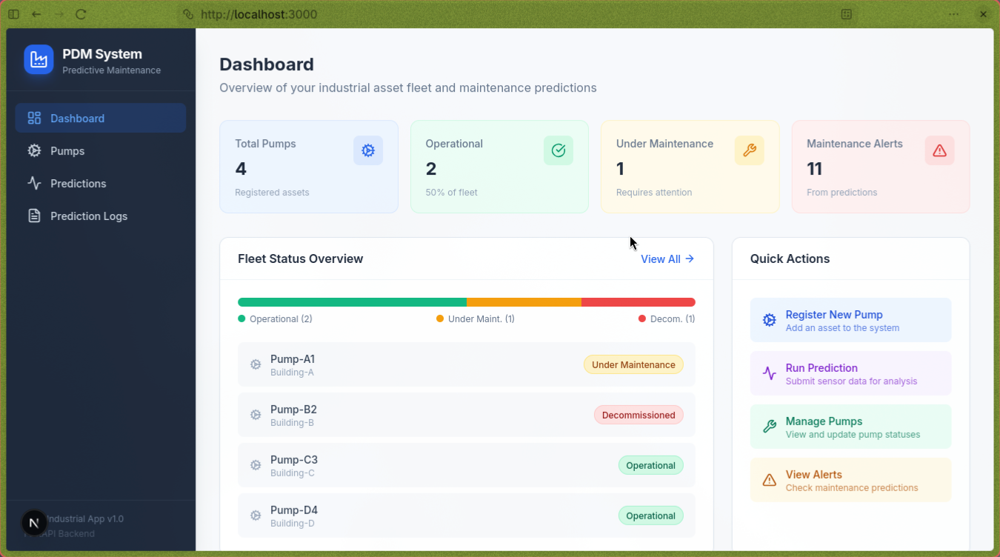
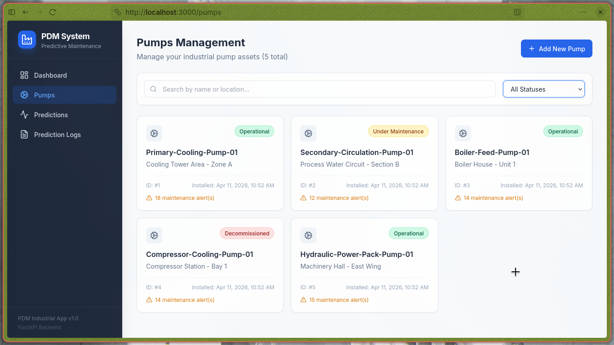

# Predictive Maintenance API (PDM Industrial App)

[](https://github.com/heyaankit/pdm-industrial-app/stargazers)
[](https://github.com/heyaankit/pdm-industrial-app/network)
[](https://github.com/heyaankit/pdm-industrial-app/issues)
[](https://github.com/heyaankit/pdm-industrial-app/blob/main/LICENSE)
[](https://www.python.org/)
[](https://nextjs.org/)
[](https://fastapi.tiangolo.com/)

A full-stack predictive maintenance system for industrial pumps with a FastAPI backend and Next.js frontend.

## Features

- **Full CRUD for pumps** - Create, read, update pump assets
- **ML-powered predictions** - Predicts maintenance needs based on sensor data
- **Detailed factor analysis** - Shows exactly which parameters (temperature, vibration, pressure, etc.) are problematic
- **Status management** - Track pump status (Operational, Under Maintenance, Decommissioned)
- **Prediction logs** - View history of all predictions
- **SQLite database** - Simple, file-based database for easy setup

## Tech Stack

### Backend
- **FastAPI** - Modern Python web framework
- **SQLAlchemy** - ORM for database operations
- **SQLite** - File-based database
- **Pydantic** - Data validation
- **Python** - Core language

### Frontend
- **Next.js 15** - React framework with App Router
- **Tailwind CSS** - Styling
- **Recharts** - Data visualization
- **TypeScript** - Type safety

## Project Structure

```
pdm-industrial-app/
├── app/                    # FastAPI backend application
│   ├── main.py            # App entry point & endpoints
│   ├── api/v1/endpoints/  # API route handlers
│   ├── models/            # SQLAlchemy models
│   ├── schemas/           # Pydantic schemas
│   ├── services/          # Business logic (feature engineering)
│   └── db/                # Database config
├── ml/pump/               # ML prediction module
│   ├── predict.py        # Prediction logic with factor analysis
│   ├── preprocess.py      # Feature preprocessing
│   └── preprocessing.py  # Colab notebook code
├── frontend/              # Next.js frontend application
├── data/                  # Database (pdm.db)
├── app_images/            # App screenshots
├── dataset/               # Training data
└── requirements.txt       # Python dependencies
```

## How to Run Locally

### Prerequisites
- Python 3.10+
- Node.js 18+

### 1. Clone and setup

```bash
git clone https://github.com/heyaankit/pdm-industrial-app.git
cd pdm-industrial-app
```

### 2. Set up Python environment

```bash
# Create virtual environment (optional but recommended)
python -m venv .venv
source .venv/bin/activate  # On Windows: .venv\Scripts\activate

# Install Python dependencies
pip install -r requirements.txt
```

### 3. Start the Backend API

```bash
# From project root
uvicorn app.main:app --reload
```

The backend runs at: **http://localhost:8000**

API documentation available at: **http://localhost:8000/docs**

### 4. Start the Frontend

Open a new terminal:

```bash
cd pdm-industrial-app/frontend
npm install
npm run dev
```

The frontend runs at: **http://localhost:3000**

### 5. Access the Application

Open your browser and go to **http://localhost:3000**

The frontend is pre-configured to connect to the backend at **http://localhost:8000** (configured in `frontend/.env.local`).

## App Screenshots





View all screenshots: [app_images/](app_images/)

## API Endpoints

### Pump Management

| Method | Endpoint | Description |
|--------|----------|-------------|
| POST | `/pumps` | Create a new pump |
| GET | `/pumps` | List all pumps |
| GET | `/pumps/{id}` | Get pump by ID |
| PATCH | `/pumps/{id}/status?status=Value` | Update pump status |

**Valid status values:** `Operational`, `Under Maintenance`, `Decommissioned`

### Prediction

| Method | Endpoint | Description |
|--------|----------|-------------|
| POST | `/api/v1/predict` | Get maintenance prediction |

### Prediction Logs

| Method | Endpoint | Description |
|--------|----------|-------------|
| GET | `/prediction-logs` | Get all prediction logs |
| GET | `/prediction-logs?pump_id=1` | Get logs filtered by pump |
| GET | `/pumps/{id}/prediction-logs` | Get logs for specific pump |

**Request body:**
```json
{
  "pump_id": 1,
  "temperature": 85.5,
  "vibration": 0.042,
  "pressure": 120.3,
  "flow_rate": 95.7,
  "rpm": 1450,
  "operational_hours": 3500
}
```

**Response:**
```json
{
  "maintenance_required": "Yes",
  "confidence_score": 0.95,
  "details": {
    "factor_details": {
      "temperature": {
        "status": "critical",
        "value": 145.0,
        "threshold": 140.0,
        "reason": "Temperature critically high"
      }
    },
    "score_breakdown": {
      "thermal": {"score": 5, "threshold": 3, "triggered": true},
      "mechanical": {"score": 3, "threshold": 3, "triggered": true},
      "hydraulic": {"score": 0, "threshold": 3, "triggered": false},
      "wearout": {"score": 0, "threshold": 3, "triggered": false}
    }
  }
}
```

## Prediction Logic

The API uses a scoring system based on domain knowledge to predict maintenance:

- **Thermal Failure**: High temperature + high RPM
- **Mechanical Failure**: High vibration + high RPM
- **Hydraulic Failure**: High pressure + low flow rate
- **Wear-out Failure**: High operational hours + high vibration

Each failure type has a score calculated from sensor values against thresholds (derived from dataset quantiles). If any score >= 3, maintenance is required.

## Example Usage (cURL)

### Create a pump
```bash
curl -X POST http://localhost:8000/pumps \
  -H "Content-Type: application/json" \
  -d '{"name": "Pump-001", "location": "Building A"}'
```

### Get a prediction
```bash
curl -X POST http://localhost:8000/api/v1/predict \
  -H "Content-Type: application/json" \
  -d '{"pump_id": 1, "temperature": 145, "vibration": 5.0, "pressure": 280, "flow_rate": 5, "rpm": 2800, "operational_hours": 9500}'
```

### Update pump status
```bash
curl -X PATCH "http://localhost:8000/pumps/1/status?status=Under%20Maintenance"
```

### Get all prediction logs
```bash
curl -s http://localhost:8000/prediction-logs
```

## Database

The database file is stored at `data/pdm.db`. You can inspect it:

```bash
sqlite3 data/pdm.db "SELECT * FROM pumps;"
sqlite3 data/pdm.db "SELECT * FROM pump_prediction_logs;"
```

## Requirements

- Python 3.10+
- Node.js 18+

See `requirements.txt` for Python dependencies.

## License

MIT License